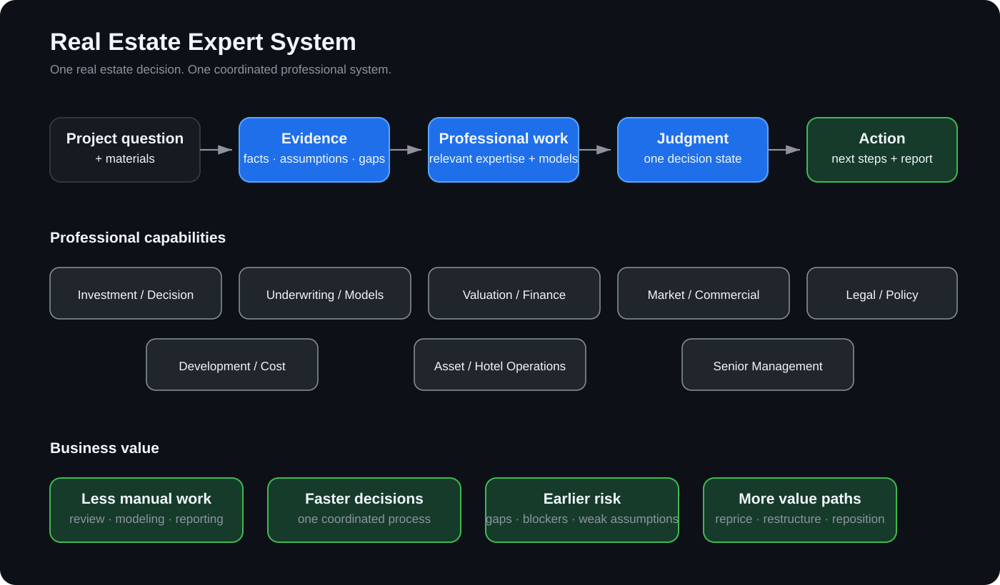

# Real Estate Expert System

**One real estate decision. One coordinated professional system.**

Real estate decisions rarely belong to one discipline. Acquisition, development, refinancing, repositioning, operating assets and diligence can require investment, underwriting, valuation, finance, market, legal, development, operations and senior-management judgment to work together.

This system organizes that work around the decision the client actually needs to make.

The client brings:

**a real question + available project materials**

The system returns:

**evidence → professional analysis → judgment → next actions → client-ready deliverable**

  

## Why this is different

This is not a chatbot that gives one answer.

It is not a fixed underwriting template.

It is not nine specialist reports stitched together.

The system is designed to identify the decision, bring in only the professional work that matters, keep missing evidence visible, stop unsupported analysis, synthesize one decision state and explain what happens next.

## Business value

**Reduce professional labor.** Move document review, issue spotting, evidence organization, repeated analysis, model preparation and report assembly into a reusable system.

**Shorten screening and diligence cycles.** Bring fragmented work into one decision process.

**Expose expensive mistakes earlier.** Weak assumptions, missing evidence and decision blockers remain visible.

**Discover more value paths.** Test reprice, restructure, refinance, reposition, hold, sell, operate or exit alternatives instead of only asking whether a deal passes.

**Increase team capacity.** Let a smaller team handle more decisions without recreating a full specialist group for every asset.

**Preserve decision memory.** Keep the facts, assumptions, failed paths, changed judgments and reopen conditions attached to the case.

## Supported decisions

- Acquisition screening
- Development feasibility
- Hold / sell / refinance
- Hotel and operating-asset review
- Diligence and risk review
- Repositioning and value-creation analysis
- Custom institutional real-estate workflows

## Professional capabilities

The system can organize work across:

1. Investment / Decision Lead
2. Underwriting & Model Strategy
3. Valuation & Financial Modeling
4. Finance & Credit
5. Development / Land / Cost
6. Market & Commercial Strategy
7. Legal / Regulatory / Policy
8. Asset / Hotel Operations
9. Investment Committee / Senior Management Judgment

The client receives one integrated decision package rather than disconnected specialist notes.

## What comes back

Depending on the case, a decision package can include:

- decision state and rationale;
- deal thesis and thesis-breakers;
- facts, assumptions and unresolved evidence;
- valuation, cash-flow, debt or development scenarios;
- material legal, market, cost and operating risks;
- prioritized diligence;
- reprice, restructure, refinance, reposition or exit paths;
- next actions;
- reopen conditions;
- a client-readable report.

## Real case

A U.S. select-service hotel acquisition screening returned:

**MORE DILIGENCE REQUIRED**

Underwriting remained:

**BLOCKED**

The system preserved:

**11 material unresolved facts**

instead of forcing a premature investment conclusion.

It decomposed the seller thesis, prioritized diligence and connected missing evidence to possible actions such as continue, reprice, restructure, reopen or decline.

See CASES.md.

## How to start

**1. Bring the real decision.**  
Example: Should we keep pursuing this acquisition?

**2. Upload the materials you already have.**  
OM, financials, operating data, financing assumptions, plans, legal or market materials.

**3. The system organizes the professional work.**  
It identifies what is known, what is missing, which expertise matters and which analysis should run.

**4. Receive the decision package.**  
Judgment, evidence gaps, risks, scenarios, actions and a client-readable deliverable.

**5. Reopen when new evidence arrives.**  
The case continues instead of restarting from zero.

## Core discipline

**Evidence before confidence.**  
**Unknown stays unknown.**  
**Models support judgment; they do not replace it.**  
**A decision must lead to action.**  
**New evidence can change the judgment.**

## Public boundary

This repository is a business and evidence showcase, not the production runtime.

Production code, private case evidence, proprietary professional assets, internal routing and protected implementation remain separate.

**Have a live acquisition, development or asset question? Bring the question and available materials for a bounded pilot.**
